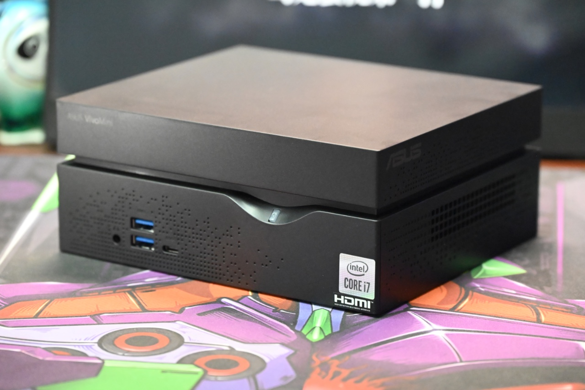

## ASUS VC66-C2 Hackintosh OpenCore EFI



### [简体中文](https://github.com/hackintosh-club/ASUS-VC66-C-MiniPC-OpenCore)

### **[Bilibili Video](https://www.bilibili.com/video/BV1j94y1y7tP)**

[OpenCore 0.9.4](https://github.com/acidanthera/OpenCorePkg)

### OS Version Tested

- macOS Monterey 12.x
- macOS Ventura  13.x 

### Hardware

- Motherboard: B460
- Bios Version: 1603 10/18/2022
- CPU: Intel 10th i7-10700
- RAM: SK hynix 16GB DDR4 3200Mhz * 1
- SSD: WD SN 350 1TB MacOS
- SSD: WD Green SATA 240G Windows
- iGPU: Intel UHD630
- Audio: Realtek ALC897
- Card: Reader Realtek USB 2.0
- WIFI: Intel
- LAN: Intel L219V 12
- PSU:  ASUS ADP-150CH B 150W

### Notes

 - Use [OpenCore Configurator](https://mackie100projects.altervista.org/opencore-configurator/) or [OCAuxiliaryTools](https://github.com/ic005k/OCAuxiliaryTools) build your SMBIOS

### Bios Setup

```
Advanced
        |-- CPU Configuratiion
	         |-- SGX:Disabled
	         |-- VMX:Enabled
	      
	      |-- Onboard Devices Configuration
           |-- Serial Port:Disabled
           
BOOT
	      |-- Secure Boot
	         |-- OS Type:Other OS
	         
		    |-- Boot Configuration
		       |-- Fast Boot:Disabled
		       |-- POST Delay Time:0 sec
```

### Contact Us

QQ Group: 23304408


### Tools

- [Hackintool](https://github.com/headkaze/Hackintool) 
- [OCAuxiliaryTools](https://github.com/ic005k/OCAuxiliaryTools) AKA `OCAT`.
- [OpenCore Configurator](https://mackie100projects.altervista.org/opencore-configurator/) AKA `OCC`.
- [gibMacOS](https://github.com/corpnewt/gibMacOS) Build your own MacOS image.
- [ProperTree](https://github.com/corpnewt/ProperTree) Plist editor.
